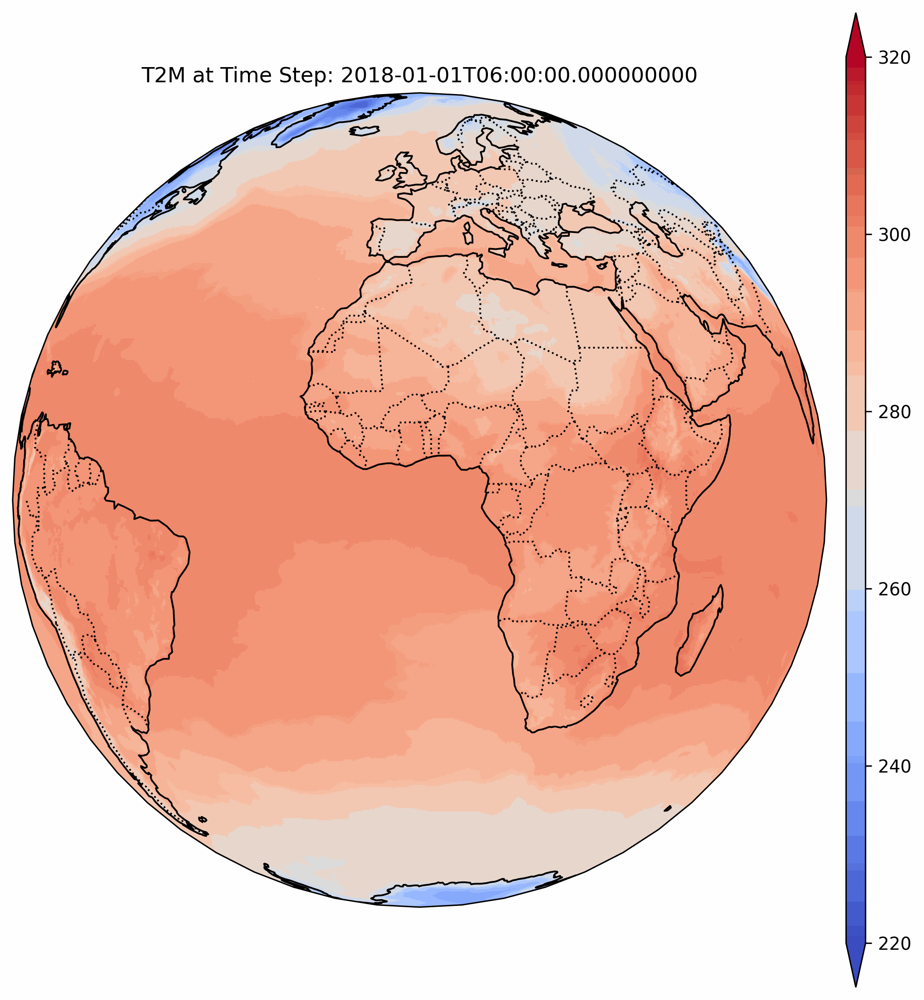

    

# Skyrim

This document serves as an internal progress tracker for the development of a wrapper library that integrates several publicly available models. The goal is to streamline the usage and evaluation of these models for our projects.

## Installation

Pain is real. Suffering is optional. 
TBA.

## Models to Wrap

- **Pangu Weather**
  - [Original](https://github.com/198808xc/Pangu-Weather)
  - [ECMWF](https://github.com/ecmwf-lab/ai-models-panguweather)
  - [NVIDIA](https://github.com/NVIDIA/earth2mip)

- **FourcastNet**
  - [Original](https://github.com/NVlabs/FourCastNet)
  - [ECMWF](https://github.com/ecmwf-lab/ai-models-fourcastnetv2)
  - [NVIDIA](https://github.com/NVIDIA/earth2mip)

- **Graphcast**
  - [Original](https://github.com/google-deepmind/graphcast)
  - [ECMWF](https://github.com/ecmwf-lab/ai-models-graphcast)
  - [NVIDIA](https://github.com/NVIDIA/earth2mip)

- **Fuxi**
  -[Original](https://github.com/tpys/FuXi)

## Feature Development Checklist

### Live Predictions
- [ ] Implement interface for real-time predictions via ECMWF API. (MARS or equivalent)

### Model Evaluation
- [ ] Develop scripts for model performance comparison across various regions and parameters.

### Best Ensemble
- [ ] Create optimization scripts for model ensemble selection based on specific criteria (e.g., best for UK wind speed).

### Additional Exploration
- [ ] Investigate the impact of quantization on model efficiency and accuracy.

## Comparison Goals
- Establish benchmarks comparing ECMWF and original implementations to identify optimal configurations for different scenarios.

This document will be updated regularly to reflect the progress and integration of new models or features into the library. It serves as a guide for internal development efforts and aids in prioritizing tasks and milestones.
